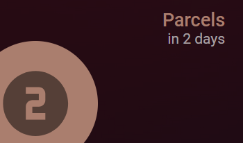

Parcel App Integration for Home Assistant
=====================================

This is an integration for Home Assistant that allows you to track your parcels using the [Parcel REST API](https://web.parcelapp.net/#apiPanel). This integration fetches the latest shipment data and displays it as a sensor in Home Assistant. This does require a pro account, but only costs $5/year.

Features
--------

-   Track most recent parcel shipments
-   Display shipment details such as description, tracking number, status code, carrier code, event date, and event location
-   Automatically updates the shipment data at a 5 minute interval.

Installation
------------

### HACS (Home Assistant Community Store)
[](https://my.home-assistant.io/redirect/hacs_repository/?owner=jmdevita&repository=parcel-ha&category=Integration)

### Other ways to Install

1.  Ensure that you have HACS installed in your Home Assistant instance.
2.  Add this repository to HACS as a custom repository.
3.  Search for "Parcel" in HACS and install it.

Configuration
-------------

### Adding the Integration

1.  In Home Assistant, navigate to **Configuration** > **Devices & Services**.
2.  Click on **Add Integration** and search for "Parcel".
3.  Follow the prompts to enter your Parcel API key. You can find your key [here](https://web.parcelapp.net/#apiPanel)

### Configuration Options

You can configure the integration options by navigating to **Configuration** > **Devices & Services**, selecting the Parcel integration, and clicking on **Options**.

Usage
-----

Once the integration is set up, it will create a sensor entity named sensor.parcel_recent_shipment. This sensor will display the most recent shipment event and provide additional attributes with detailed information about the shipment.

### Sensor Attributes
-   `full_description`: Full description of the shipment.
-   `tracking_number`: Tracking number of the shipment.
-   `date_expected`: Date the shipment is expected.
-   `event_date`: Date of the latest shipment event.
-   `event_location`: Location of the shipment event.
-   `status`: The converted (from status code) delivery status of the shipment.
-   `carrier`: The converted (from carrier code) carrier name of the shipment.

From v1.0.0 a second sensor entity is added, called sensor.parcel_active_shipment. It's intended to be used to provide information about when the next shipment is due, and how many shipments are currently actively being tracked. It has the following attributes:

### Sensor Attributes
-   `Number_of_active_parcels`: The number of active shipment being tracked.
-   `parcels_arriving_today`: The number of shipment with an ETA of the current date.
-   `Full description`: Full description of the next shipment.
-   `tracking_number`: Tracking number of the shipment.
-   `date_expected`: Date the shipment is expected.
-   `days_until_next_delivery`: The number of days until the next delivery or text description.
-   `event`: The state of the latest shipment event.
-   `event_date`: Date of the latest shipment event.
-   `event_location`: Location of the shipment event.
-   `next_delivery_status`: The converted (from status code) delivery status of the next shipment arriving.
-   `next_delivery_carrier`: The converted (from carrier code) carrier name of the next shipment arriving.

## Custom Button Card

If you are familiar with custom button card, one way to use the active_parcel_shipment sensor is with the following button card template:

```
type: custom:button-card
entity: sensor.parcel_active_shipment
name: Parcels
show_name: true
show_icon: true
show_state: true
styles:
  grid:
    - grid-template-areas: '"i n" "i s"'
    - grid-template-columns: auto 1fr
    - grid-template-rows: 12px 12px
  card:
    - padding: 22px 22px 22px 22px
    - height: 150px
    - background: rgba(10,10,10,0.85)
  name:
    - justify-self: end
    - font-size: 18px
    - font-weight: 500
    - color: '#d2ae71'
  state:
    - justify-self: end
    - font-size: 14px
    - opacity: '0.7'
    - padding-top: 12px
    - padding-left: 0px
  img_cell:
    - justify-content: start
    - position: absolute
    - width: 120px
    - height: 120px
    - left: 0
    - bottom: 0
    - margin: 0 0 -20px -20px
    - background: '#d2ae71'
    - border-radius: 500px
  icon:
    - position: relative
    - width: 75px
    - color: black
    - opacity: "0.5"
```



You may want to modify the dimensions, opacity, etc to suit your tastes.

Development
-----------

### Prerequisites

-   Home Assistant
-   HACS

Contributing
------------

Contributions are welcome! Please open an issue or submit a pull request on the [GitHub repository](https://github.com/jmdevita/parcel-ha/pulls).

License
-------

This project is licensed under the GNU General Public License v3.0. See the [LICENSE](/LICENSE) file for details.

Support
-------

If you encounter any issues or have questions, please open an issue on the [GitHub repository](https://github.com/jmdevita/parcel-ha/issues).

Acknowledgements
----------------

This integration uses the Parcel REST API. Special thanks to the developer of the Parcel API for providing this service.

* * * * *

**Note:** This integration is unofficial and not affiliated with the Parcel API developers.
